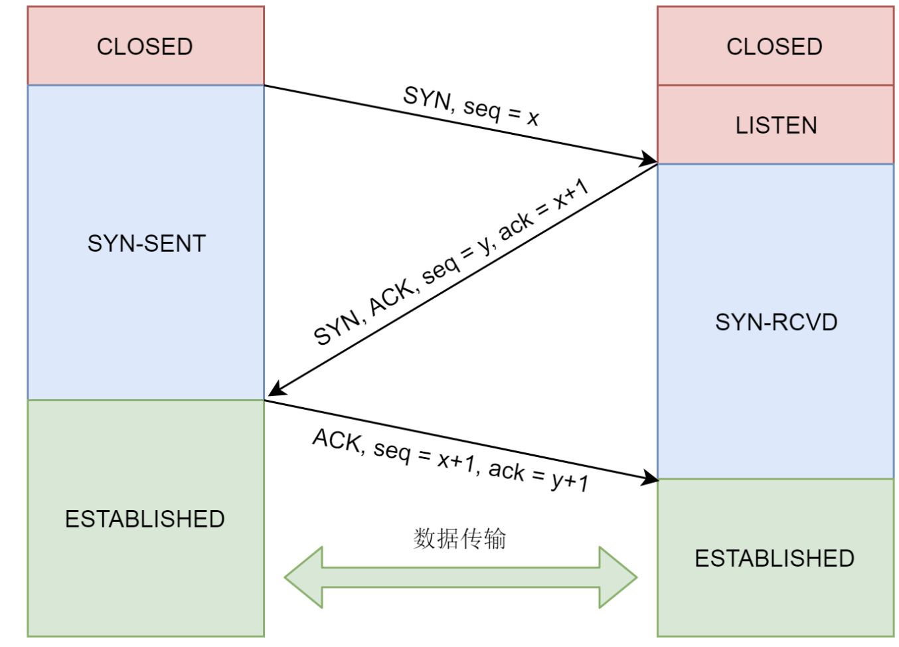
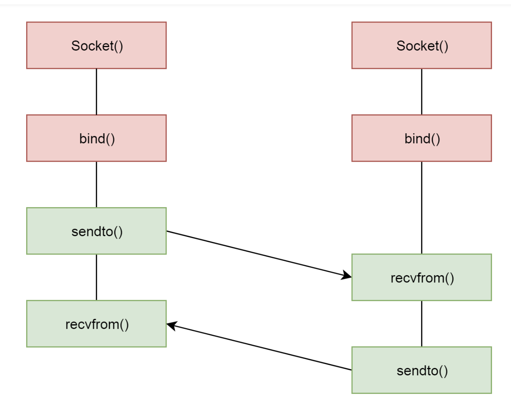

# Socket通信
```c
#include <sys/types.h>          /* See NOTES */
#include <sys/socket.h>
int socket(int domain, int type, int protocol);

domain:ip层协议
    AF_INET             IPv4 Internet protocols          ip(7)
    AF_INET6            IPv6 Internet protocols          ipv6(7)
     ....
    
type:
      // tcp 顺序可靠
       SOCK_STREAM     Provides sequenced, reliable, two-way, connection-based
                       byte  streams.  An out-of-band data transmission mecha‐
                       nism may be supported.

       // udp 数据报 
       SOCK_DGRAM      Supports datagrams (connectionless, unreliable messages
                       of a fixed maximum length).


       //  直接操作IP层(ICMP)
       SOCK_RAW        Provides raw network protocol access.
       ......

protocol:
    表示协议
    IPPROTO_TCP、IPPTOTO_UDP

```
## TCP下如何编程
```c
#include <sys/types.h>          /* See NOTES */
#include <sys/socket.h>
int bind(int sockfd, const struct sockaddr *addr,socklen_t addrlen);

struct sockaddr {
    sa_family_t sa_family;
    char        sa_data[14];
}

sockfd:创建socket 文件描述符

TCP/IP 是按照大端 而 x86 是按小端设计的发出去数据要从小端转向大端
```

```c
#include <sys/types.h>          /* See NOTES */
#include <sys/socket.h>
int listen(int sockfd, int backlog);// 进入 Listen 状态
//backlog  等待请求的队列数 大于队列 会拒绝连接  ECONNREFUSED
TCP 三次握手在内核完成,应用层不参与


int accept(int sockfd, struct sockaddr *addr, socklen_t *addrlen);
会等待到连接队列里面有链通过三次握手的客户端socket 并且获取队列里面的一个


#include <sys/types.h>          /* See NOTES */
#include <sys/socket.h>
int connect(int sockfd, const struct sockaddr *addr,socklen_t addrlen);
客户端通过connect 发送起连接
```
## UDP

```c
ssize_t sendto(int sockfd, const void *buf, size_t len, int flags, const struct sockaddr *dest_addr, socklen_t addrlen);
 
ssize_t recvfrom(int sockfd, void *buf, size_t len, int flags, struct sockaddr *src_addr, socklen_t *addrlen);

udp 大家都是客户端 没有 listen 等概念

```